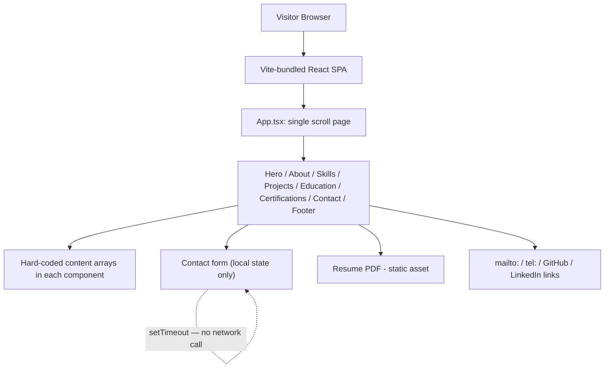

# Sanjith Reddy — Personal Developer Portfolio

A single-page personal portfolio site for **Yaramada Sanjith Reddy**, a front-end developer (B.Tech, 2nd year) based in Hyderabad, India, built to showcase skills and projects for internship applications. There is no backend, no database, and no real form submission — everything on the page is either static content or a client-side-only interaction.

---

## 1. What This Project Actually Is

| | |
|---|---|
| **Type** | Personal portfolio — single scrolling page, not a multi-route site |
| **Origin** | Generated with **Figma Make** (`package.json` name is `@figma/my-make-file`; `vite.config.ts` includes a custom `figma-asset-resolver` plugin and a comment noting the React/Tailwind plugins are required "for Make, even if Tailwind is not being actively used") |
| **Framework** | Vite 6 + React 18 (peer dependency) + TypeScript |
| **Styling** | Tailwind CSS v4, inline CSS variables (`var(--primary)`, `var(--accent)`, etc.) for theming, `motion` (Framer Motion) for animation |
| **Backend** | None. No API routes, no server, no database |
| **Auth** | None — nothing to authenticate |
| **Routing** | None — `react-router` is installed as a dependency but is **never imported or used anywhere** in `src/` |
| **Deployment target** | Not specified in-repo (no Vercel/Netlify config); `index.html` has `<meta name="robots" content="noindex, nofollow">`, so as committed the site is explicitly telling search engines not to index it |

---

## 2. Page Structure

The entire site is one component tree rendered by `src/main.tsx` → `src/app/App.tsx`, which stacks eight sections in a single scrollable page (no separate routes):

```
Navbar
Hero            (id="hero")
About           (id="about")
Skills          (id="skills")
Projects        (id="projects")
Education       (id="education")
Certifications  (id="certifications")
Contact         (id="contact")
Footer
```

Navigation is anchor-link scrolling (`#about`, `#skills`, etc.), not client-side routed pages — `Navbar.tsx` uses an `IntersectionObserver` to highlight the current section as the user scrolls, and buttons in `Hero.tsx` call `scrollIntoView()` directly rather than navigating.

`App.tsx` also handles a simple dark-mode toggle: it checks `window.matchMedia("(prefers-color-scheme: dark)")` on mount and toggles a `dark` class on `<html>` from then on — there's no persistence (it resets to the OS preference on every reload, not to whatever the user picked last).

---

## 3. Content, Section by Section

All content is hard-coded directly inside each component as TypeScript literals/arrays — there is no CMS, no markdown files, and no data-fetching of any kind.

- **Hero** — Name, title ("Front-End Developer"), a tech-stack line (HTML · CSS · JavaScript · React.js), and three CTAs: scroll-to-Projects, a resume download, and scroll-to-Contact. Includes a canvas-based animated particle/connection-line background (hand-rolled with `requestAnimationFrame`, not a library) and a decorative fake "code editor" card showing a JS object literal of the same info.
- **About** — Static bio content.
- **Skills** — Three categories (Frontend; Styling & Layout; Tools & Workflow), each skill given a name, an emoji icon, and a hard-coded proficiency percentage (e.g. React.js: 78, Tailwind CSS: 92) rendered as an animated progress bar that fills in once scrolled into view (via `IntersectionObserver`).
- **Projects** — Three hard-coded project cards: an E-Commerce Store Application, a Task Management Dashboard, and a Job Portal Application, each with a description, tech tags, and a screenshot hosted on an external image host (`imgdb.in`).
- **Education** — A single academic entry with a short coursework list (Web Technologies, Data Structures, OOP).
- **Certifications** — Three hard-coded certificate entries (Coursera Front-End Developer, HackerRank JavaScript Algorithms & Data Structures, freeCodeCamp Responsive Web Design), each with a hand-drawn inline SVG "logo" rather than a real badge image.
- **Contact** — Real contact info (email, phone, location, GitHub, LinkedIn — all as working `mailto:`/`tel:`/external links) plus an in-page message form (see below).
- **Footer** — Static closing content.

`useScrollReveal.ts` is a small shared hook used by most sections: it fades/slides a section in via an `IntersectionObserver` the first time it enters the viewport.

---

## 4. Interactive Elements — What's Real vs. Simulated

This is the most important accuracy note, the same kind of gap flagged in the Tejas Innovations analysis:

### Resume download — real
`Hero.tsx` imports an actual file, `src/imports/my_resume.pdf`, via Vite's asset pipeline and links straight to it. This works with no backend involved.

### Contact form — UI only, does not send anything
`Contact.tsx` maintains its own `name` / `email` / `message` state and a `handleSubmit` that does this:

```js
const handleSubmit = (e) => {
  e.preventDefault();
  if (!form.name || !form.email || !form.message) return;
  setLoading(true);
  setTimeout(() => {
    setLoading(false);
    setSubmitted(true);
  }, 1200);
};
```

There is no `fetch()`, no email service (no EmailJS/Formspree/Resend, etc.), and no API route anywhere in the repo. The 1.2-second delay exists purely to simulate a network request before showing a "Message Sent!" confirmation screen. **Anything typed into this form is discarded** — a visitor who uses it believes a message was sent, but nothing is transmitted. The real, working contact channels on the page are the direct `mailto:`/`tel:`/GitHub/LinkedIn links, not the form.

### Project links — partially placeholder
All three project cards' **GitHub** buttons point to the same generic profile URL (`github.com/sanjithreddy11-ui`) rather than each project's own repository, and every **Live Demo** button links to `"#"` (i.e., nowhere). The project descriptions read as complete, shipped work, but there is currently no way to actually view the code or a live version of any of the three from this page.

---

## 5. Dependencies — What's Actually Used vs. Unused Boilerplate

This is a Figma Make scaffold, and it ships with a large UI/library surface that the app barely touches:

**Actually used:** `react`, `react-dom`, `motion` (Framer Motion, imported as `motion/react`), `lucide-react` (icons throughout), Tailwind CSS v4.

**Installed but not used anywhere in `src/`:**
- `react-router` — no `<Router>`, no `<Route>`, no navigation hook is used; the site is single-page with anchor scrolling only.
- The entire Radix UI primitive set (`@radix-ui/react-*` — accordion, dialog, dropdown-menu, tabs, tooltip, etc.) and the pre-built `src/app/components/ui/*.tsx` shadcn-style wrapper components around them.
- `@mui/material`, `@mui/icons-material`, `@emotion/*` — Material UI and its styling engine.
- `recharts`, `embla-carousel-react`, `react-slick`, `react-responsive-masonry`, `cmdk`, `vaul`, `sonner`, `react-hook-form`, `react-day-picker`, `input-otp`, `react-dnd` (+ HTML5 backend), `canvas-confetti`, `date-fns`, `next-themes`.

None of these are imported by `Hero`, `About`, `Skills`, `Projects`, `Education`, `Certifications`, `Contact`, `Navbar`, or `Footer`. They're default scaffolding from the Figma Make template (a general-purpose shadcn/Radix/MUI component kit is bundled in every project it generates) and were never trimmed down for this single-page site. In their current form, `src/app/components/ui/*.tsx` is dead code as far as this app is concerned.

---

## 6. Third-Party Integrations

| Service | Where | Purpose |
|---|---|---|
| **imgdb.in** | `Projects.tsx` | External hosting for the three project screenshot images (no local copies) |
| **Google Search Console** (implied) | `public/googleeddd9bbc8a2c8bbb.html` | Static domain-verification file, identical in filename to the one in the Tejas Innovations repo — no code integration, no analytics script actually wired up here (unlike the agency site, there is no `<GoogleAnalytics>` call anywhere in this repo) |

No email service, no payment processor, no CMS, no auth provider, and no analytics are actually integrated into the running app.

---

## 7. Data Layer

None. There is no database, no local storage usage for persistence (despite the Skills/Projects copy in the site describing *other* apps that use Local Storage — that's project-description text, not something this portfolio itself does), and no server-side state. Every piece of "data" — bio, skills, project list, education, certifications, contact details — is a literal array or string inside its respective component file.

---

## 8. Architecture



There's no client → API → database chain anywhere in this project — the entire "architecture" is a single client-rendered bundle with hard-coded content and a handful of outbound links.

---

## 9. Tech Stack Summary

- **Build tool:** Vite 6
- **Framework:** React 18.3.1 (peer dependency), TypeScript
- **Styling:** Tailwind CSS v4, inline CSS custom properties for theming (`src/styles/theme.css`, `globals.css`, `fonts.css`, `index.css`)
- **Animation:** `motion` (Framer Motion) for section transitions, a hand-rolled canvas particle effect in `Hero.tsx`
- **Icons:** `lucide-react`
- **Fonts:** Inter, Outfit, and JetBrains Mono (referenced via inline `fontFamily` styles)
- **Scaffold origin:** Figma Make (bundles Radix UI, MUI, and a large shadcn-style component kit by default, most of it unused here)

---

## 10. Getting Started

```bash
npm install
npm run dev
```

```bash
npm run build   # production build via Vite
```

No environment variables are required — there are no API keys, secrets, or backend URLs anywhere in the codebase.

---

## 11. Known Gaps / Honest Caveats

- **The contact form doesn't send anything.** It's a convincing "loading → sent" simulation with a `setTimeout`, but no message is ever transmitted anywhere. If this is meant to be a real lead channel, it needs a real backend — e.g. Formspree, EmailJS, or a small serverless function — the same fix needed for the modal in the Tejas Innovations project.
- **Project cards don't link to real repos or live demos.** GitHub links all point to the profile root, and "Live Demo" links are placeholder `#` hrefs.
- **`react-router` and the entire Radix/MUI/shadcn UI kit are installed but unused**, left over from the Figma Make scaffold. They add real weight to `node_modules` and the dependency tree without being part of the shipped page — worth trimming from `package.json` if bundle size or install time becomes a concern.
- **Dark mode doesn't persist.** It's derived fresh from the OS preference on every load; there's no `localStorage` save of the user's toggle choice.
- **`index.html` sets `robots: noindex, nofollow`**, so as currently configured this site won't be indexed by search engines even once deployed — likely fine for a portfolio shared via direct link, but worth knowing if organic discoverability is a goal.
